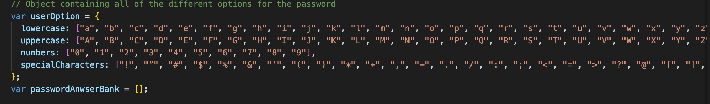
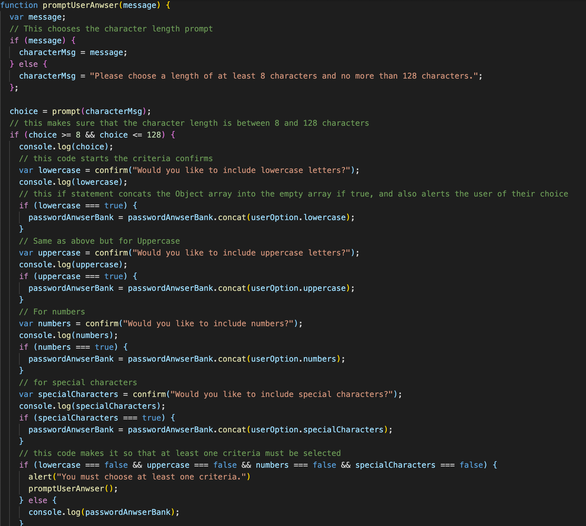
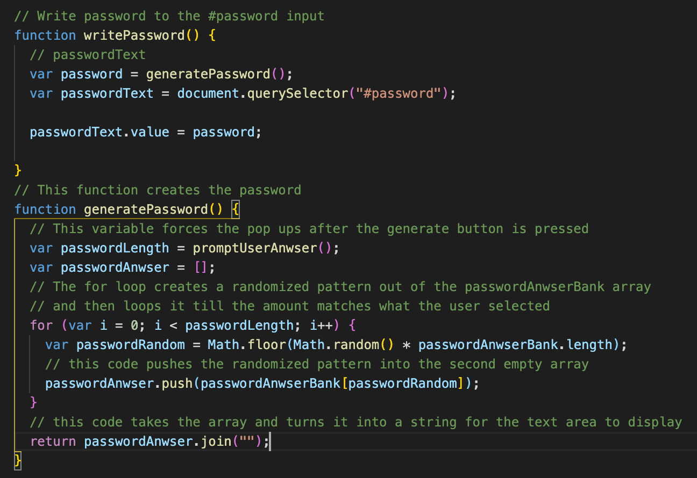
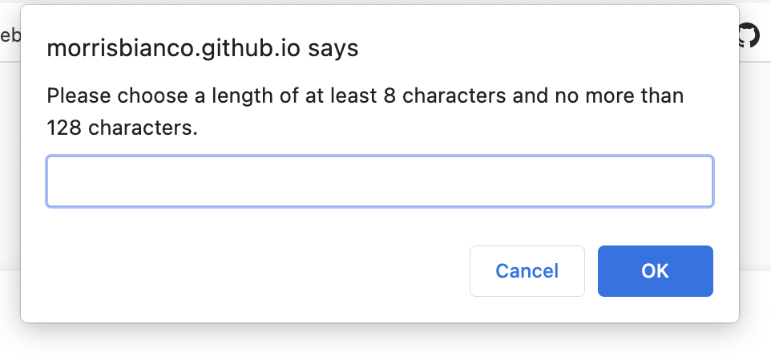
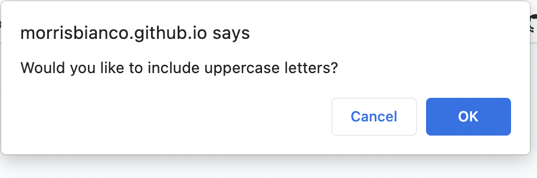
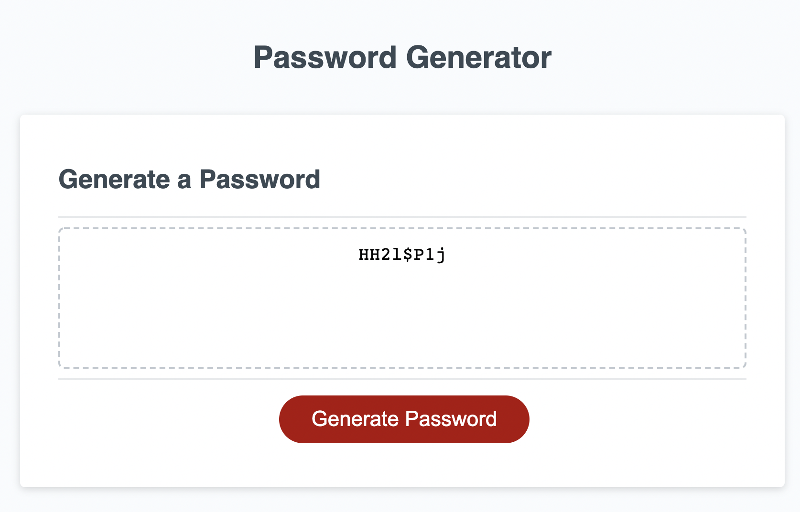

# Password Generator Project

## Table of Contents

- Description
- Usage

[Description](#Description)

For this project, I was given access to a pre-built site that would work as a password generator. To finish the site, I needed to write the javascript in the incomplete script.js folder. 

To complete the code, I started by adding an object containing all of the arrays that I would need to give to the password, such as lowercase and uppercase letters, numbers, and special characters. Along with two empty arrays, one to insert the chosen criteria into and another to insert the randomized criteria.

After that I started working on the first prompt which would ask the user for the length of the password. After the user had selected a correct number, which had to be between 8 and 128 characters or else a invalid choice alert would appear, a series of confirms would appear regarding the content of the password.

Each of these confirms would ask the user if they wanted lowercase letters, uppercase letters, numbers, and special characters. When the user had selected their choices, the corresponding array would be inserted into an empty array. 

From there, the now filled array would be inserted into a for loop that contains a randomizing code that would loop as many times as necessary until the length matches what the user inputted. Then the now randomized password would be inserted into another array and then turned into a string.

Finally, the password is displayed in the text area.

[Usage](#Usage)

To use this application, you start by clicking on the generate button. Following that, the first prompt will appear asking for the length of the password. Once you have chosen a length following the criteria given, another series of questions will appear asking for details of what is to be put into the password.

Once you have chosen all of the criteria for what is to be in the password. Your now randomized password will be displayed in the text area.

Here is a link to the deployed site: https://morrisbianco.github.io/password-generator-project/
